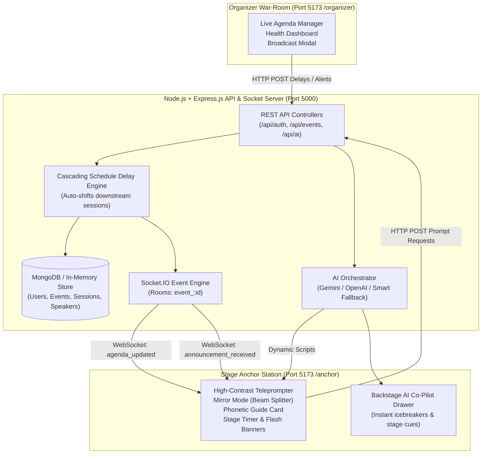

# StagePilot (StageFlow) – Comprehensive Project Overview 🎙️⚡

> **Next-Generation Real-Time Event Management & AI-Assisted Live Anchor Teleprompter Platform**

---

## 1. Executive Summary

Live events—such as tech conferences, summits, award ceremonies, and hackathons—are inherently volatile. Sessions overrun, VIP speakers arrive late, names are mispronounced, and stage anchors are left improvising without context.

**StagePilot** bridges the chaotic gap between the **backstage organizer** and the **front-of-house stage anchor**. Through high-speed WebSockets, an intelligent cascading schedule delay engine, high-contrast teleprompters with mirror reflection mode, and a context-aware AI script engine, StagePilot ensures that live stage performances stay synchronized, accurate, and on schedule without requiring a single page reload.

---

## 2. System Architecture



---

## 3. Core Differentiating Features

### ⏱️ 1. Intelligent Cascading Delay Engine
- When a speaker runs over by **+5, +10, or +15 minutes**, an organizer clicks a single button.
- The backend automatically shifts the start and end times for **all downstream agenda sessions**.
- The overall event health dynamically transitions (e.g., `ON_SCHEDULE` ➔ `NEEDS_ATTENTION` ➔ `RUNNING_LATE`), updating cumulative drift across all connected screens in real-time.

### 🪞 2. Stage Teleprompter with Glass Mirror Mode
- Built for physical stage teleprompter rigs and beamsplitter glass mirrors.
- Features **horizontal mirroring (`scaleX(-1)`)**, customizable **auto-scroll velocity**, adjustable font sizes, and high-contrast typography (`#05070e` dark background with crisp high-visibility text).

### 🗣️ 3. Phonetic Pronunciation Guides
- Prevents embarrassing mispronunciations of international speaker names and technical terms.
- Speaker profiles highlight phonetic spelling guides prominently on the anchor's active cue card (e.g., *Dr. Elena Rostova* ➔ `[eh-LEH-nah ross-TOH-vah]`).

### 🚨 4. Zero-Refresh Emergency Flash Broadcasts
- Backstage directors can inject critical stage directions directly into the anchor's view (e.g., *"Wrap up in 2 minutes"*, *"VIP guest has arrived"*).
- Triggers a visual high-urgency banner and an audible synthesized two-tone chime via the Web Audio API without any external media files.

### 🤖 5. Dual-Engine AI Stage Co-Pilot & Offline Resilience
- **AI Script Generation:** Generates speaker introductions, bridge transitions, delay filler scripts, and closing remarks in under 1 second.
- **Anchor Co-Pilot Drawer:** Backstage drawer capable of answering spontaneous anchor questions, producing audience show-of-hands questions, and surfacing speaker trivia.
- **Resilient Offline Smart Fallback:** If cloud AI keys (`GEMINI_API_KEY` or `OPENAI_API_KEY`) are omitted, the local rule-based Smart Fallback Engine serves contextual scripts dynamically.

---

## 4. Technology Stack

| Domain | Technology | Purpose |
| :--- | :--- | :--- |
| **Frontend UI** | **React 18 + Vite** | Instant HMR, single-page application rendering, modular components |
| **Styling** | **Tailwind CSS** | Custom stage-dark theme, high-contrast teleprompter typography |
| **Icons** | **Lucide React** | Modern, accessible iconography |
| **Visualizations** | **Recharts** | Real-time event drift and schedule timeline charts |
| **Audio Engine** | **Web Audio API** | Pure synthesized 800Hz / 600Hz frequency chime for urgent alerts |
| **Backend API** | **Node.js + Express.js (ESM)** | Modular REST routing, controllers, input validation |
| **Real-Time Sync**| **Socket.IO** | Bi-directional room-based event broadcasting (`event_:id`) |
| **Database** | **MongoDB + Mongoose** | Structured document schemas (Users, Events, Sessions, Speakers) |
| **Zero-Config DB**| **MongoMemoryServer** | Embedded in-memory MongoDB fallback with auto-seeding |
| **Security & Auth**| **JWT & Bcrypt** | Role-Based Access Control (`ORGANIZER` vs. `ANCHOR`) |
| **AI Integration**| **Gemini & OpenAI SDKs** | Context-assembled prompt pipeline with dynamic fallback scripts |

---

## 5. Repository Structure

```text
StageFlow/
├── client/                           # React + Vite Frontend Application
│   ├── src/
│   │   ├── api/                      # Axios REST client (auth, events, sessions, AI)
│   │   ├── components/
│   │   │   ├── anchor/               # Teleprompter, StageTimer, CurrentSession, UrgentBanner
│   │   │   ├── organizer/            # AgendaManager, DelayModal, BroadcastModal, HealthCard
│   │   │   ├── ai/                   # AnchorCopilotDrawer, ScriptGeneratorModal
│   │   │   └── common/               # Navbar, Buttons, Modals, Badges, Loaders
│   │   ├── context/                  # AuthContext, SocketContext, EventContext
│   │   ├── hooks/                    # useLiveEvent, useCountdown, useSocket, useAuth
│   │   └── pages/                    # LandingPage, LoginPage, OrganizerDashboard, AnchorView
│   ├── package.json                  # Frontend dependencies
│   ├── tailwind.config.js            # Custom dark stage theme & palette
│   └── vite.config.js                # Port 5173 dev server & proxy settings
│
├── server/                           # Node.js + Express + Socket.IO Backend
│   ├── src/
│   │   ├── config/                   # Database (with auto-memory fallback), Socket, Env
│   │   ├── constants/                # Socket events, user roles, event health states
│   │   ├── controllers/              # Auth, Event, Session, Speaker, AI controllers
│   │   ├── middleware/               # JWT protection, role authorization, error handling
│   │   ├── models/                   # Mongoose schemas (User, Event, Session, Speaker, Announcement)
│   │   ├── prompts/                  # Prompt templates (Opening, Speaker Intro, Delay, Copilot)
│   │   ├── routes/                   # Express API endpoints
│   │   ├── services/                 # Cascading schedule engine, AI service, Socket service
│   │   └── utils/                    # Seed data, time calculators, automated test scripts
│   └── package.json                  # Backend dependencies
│
├── docs/                             # Technical Documentation & Specs
│   ├── API_SPECS.md                  # REST API schemas and parameters
│   ├── SOCKET_EVENTS.md              # WebSocket event payloads and triggers
│   ├── AI_API.md                     # AI context assembling and prompt templates
│   └── DEMO_SCRIPT.md                # Hackathon 3-minute presentation script
│
├── PROJECT_OVERVIEW.md               # Master Project Overview (This Document)
├── README.md                         # Quick Start & Setup Guide
└── package.json                      # Workspace scripts
```

---

## 6. Key REST API Endpoints

| Method | Endpoint | Access | Purpose |
| :--- | :--- | :--- | :--- |
| `GET` | `/api/health` | Public | System status and service health check |
| `POST` | `/api/auth/login` | Public | User authentication; returns JWT token |
| `GET` | `/api/auth/me` | Authenticated | Retrieve current user profile and role |
| `GET` | `/api/events` | Authenticated | List events managed or assigned |
| `GET` | `/api/events/:id` | Authenticated | Full event details with sessions and speakers |
| `POST` | `/api/events/:id/sessions/:id/delay` | `ORGANIZER` | **Inject schedule delay & cascade all downstream sessions** |
| `POST` | `/api/events/:id/broadcast` | `ORGANIZER` | **Broadcast emergency flash alert to stage anchors** |
| `POST` | `/api/ai/generate-script` | Authenticated | Generate contextual script (intro, delay, transition) |
| `POST` | `/api/ai/copilot-query` | Authenticated | Instant Q&A / prompt assistance via stage copilot |

---

## 7. Real-Time WebSocket Events

| Event Name | Direction | Payload Description |
| :--- | :--- | :--- |
| `join_event` | Client ➔ Server | Joins the room `event_:id` to receive live updates |
| `agenda_updated` | Server ➔ Client | Emitted when session delay or timing is altered; contains updated schedule |
| `announcement_received` | Server ➔ Client | Emitted when organizer triggers emergency alert; carries urgency level |
| `session_activated` | Server ➔ Client | Emitted when stage anchor or organizer transitions to the next live session |

---

## 8. Demo Credentials & Quick Start

### 1-Click Demo Accounts
Pre-seeded with a 4-session tech summit (*"Global Tech Horizon Summit 2026"*):

| Role | Email | Password | Intended Dashboard |
| :--- | :--- | :--- | :--- |
| **Organizer** | `organizer@stagepilot.io` | `password123` | `http://localhost:5173/organizer` |
| **Stage Anchor** | `anchor@stagepilot.io` | `password123` | `http://localhost:5173/anchor` |

### Running the Project
```bash
# 1. Start Backend Server (Port 5000)
cd server
npm start

# 2. Start Frontend Client (Port 5173)
cd client
npm run dev
```

> **Note:** If a local MongoDB instance is not detected, the backend will automatically spin up an embedded in-memory MongoDB database and populate the demo conference sessions instantly with zero manual configuration.

---

## 9. Verification & Test Suite

The project includes an automated backend & WebSocket test suite:
```bash
cd server
node src/utils/test_live_api.js
```
**Test Results:** `13 Passed, 0 Failed` (Covering Auth, Agenda Ingestion, Cascading Delays, Flash Alerts, WebSockets, AI Scripting, and Copilot Queries).
