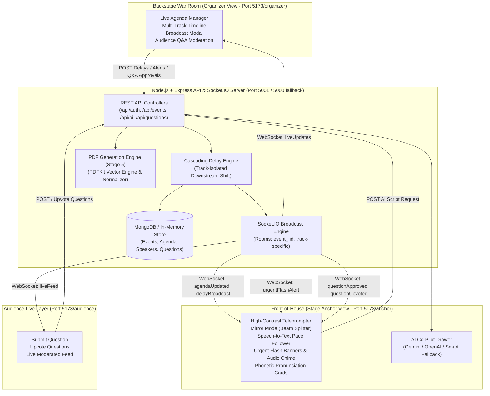

# 🚀 StagePilot (StageFlow) — Master Project Progress & Architecture Report

> **Real-Time Multi-Track Live Stage Management, AI Stage Co-Pilot & Operational PDF Exporter**  
> **Repository:** `https://github.com/rudra0279/StageFlow.git`  
> **Status:** **Stages 1, 2, 3, 4, and 5 COMPLETE & PASSING (92/92 Tests Passing)**  
> **Latest Milestone:** `feat : PDF Generation Engine (Stage 5 Exporter)`  

---

## 📑 Table of Contents
1. [Executive Summary](#1-executive-summary)
2. [End-to-End System Architecture](#2-end-to-end-system-architecture)
3. [Technology Stack](#3-technology-stack)
4. [Detailed Stage-by-Stage Implementation Progress](#4-detailed-stage-by-stage-implementation-progress)
   - [Stage 1: Stage Anchor Teleprompter & Speech Follower](#stage-1-stage-anchor-teleprompter--speech-follower)
   - [Stage 2: Organizer War Room & Cascading Delay Engine](#stage-2-organizer-war-room--cascading-delay-engine)
   - [Stage 3: Multi-Track Stage Orchestration Engine](#stage-3-multi-track-stage-orchestration-engine)
   - [Stage 4: Live Audience Q&A & Interactive Moderation](#stage-4-live-audience-qa--interactive-moderation)
   - [Stage 5: Run-of-Show PDF Exporter Engine](#stage-5-run-of-show-pdf-exporter-engine)
5. [Automated Test Suite & Regression Verification (92/92 Tests)](#5-automated-test-suite--regression-verification)
6. [API & WebSocket Event Catalog](#6-api--websocket-event-catalog)
7. [Repository File Map](#7-repository-file-map)
8. [Quick Start & Demo Walkthrough](#8-quick-start--demo-walkthrough)

---

## 1. Executive Summary

Live events—such as global tech summits, developer conferences, and hackathons—are fast-paced and prone to schedule volatility. Speakers run over time, VIP guests arrive off-schedule, names are mispronounced, and front-of-house anchors are frequently disconnected from backstage directors.

**StagePilot (StageFlow)** provides a synchronized, real-time command center:
1. **Backstage Organizers** control multi-track schedules, cascade downstream delays with one click, curate audience questions, and broadcast flash stage directions.
2. **Stage Anchors** view an ultra-high-contrast, mirrored teleprompter equipped with browser-native Speech Follower tracking, phonetic pronunciation cues, and instant AI icebreaker generation.
3. **Audience Members** scan QR codes to submit and upvote questions in real time.
4. **Operations & AV Staff** export print-ready, multi-track Run-of-Show PDF cheat sheets with clear scheduled vs. adjusted timelines and delay indicators.

---

## 2. End-to-End System Architecture



---

## 3. Technology Stack

| Layer | Technologies | Key Role in StagePilot |
| :--- | :--- | :--- |
| **Frontend UI** | **React 18, Vite 5** | Instant HMR, responsive multi-dashboard routing, sub-second reactivity |
| **Styling** | **Tailwind CSS, PostCSS** | Custom stage-dark operational theme (`#05070e`), high-visibility contrast |
| **Icons & Visuals** | **Lucide React, Recharts** | Real-time event drift telemetry, timeline graphics, clean operational icons |
| **Stage Audio** | **Web Audio API** | Pure browser-synthesized dual-tone chimes (800Hz / 600Hz) for emergency alerts |
| **Speech Tracking**| **Web Speech API (STT)** | Real-time voice follower tracking spoken words and scrolling prompter at anchor pace |
| **Backend API** | **Node.js, Express.js** | Modular REST routes, controllers, JWT authentication, role guards |
| **Real-Time Sync**| **Socket.IO (v4.8)** | Bi-directional room-based messaging (`event_:id`, track isolation, Q&A sync) |
| **Database** | **MongoDB, Mongoose 8** | Schemas for Events, Sessions/Agenda, Speakers, Questions, and ScriptLogs |
| **Zero-Config DB**| **MongoMemoryServer** | Built-in in-memory fallback database with auto-seeding for instant local execution |
| **AI Engine** | **Google Gemini SDK, OpenAI** | Dynamic speech introductions, transitions, delay fillers, and contextual Q&A |
| **Offline AI** | **StagePilot Smart Engine** | Zero-latency local fallback script generator when external AI API keys are omitted |
| **PDF Generation**| **PDFKit (v0.20.2)** | Print-ready, multi-track, vector-accurate Run-of-Show PDF generation engine |
| **Testing** | **Jest 29, Supertest** | Comprehensive regression test runner with 6 test suites and 92 automated tests |

---

## 4. Detailed Stage-by-Stage Implementation Progress

### Stage 1: Stage Anchor Teleprompter & Speech Follower
- **High-Contrast Teleprompter**: Built for dark stage conditions (`#05070e` background with `#ffffff` and `#38bdf8` high-contrast typography).
- **Glass Mirror Mode**: Single-click toggle applying CSS `transform: scaleX(-1)` to support physical beam splitter teleprompter glass rigs.
- **Variable-Speed Auto-Scroll**: Customizable scrolling speed (WPM control), smooth animations, pause/resume hotkeys.
- **Web Audio Alert Chime**: Synthesized pure two-tone emergency chime via Web Audio API without requiring external audio files.
- **Web Speech STT Follower**: Uses browser speech recognition to follow the speaker's live audio, dynamically highlighting current spoken words and pacing the scroll automatically.
- **Phonetic Pronunciation Cards**: Displays pronunciation hints for international speakers (e.g. *Dr. Elena Rostova* $\rightarrow$ `[eh-LEH-nah ross-TOH-vah]`).

### Stage 2: Organizer War Room & Cascading Delay Engine
- **Organizer War Room Dashboard**: Live overview of all agenda sessions, current running state, attendee counts, and drift metrics.
- **Cascading Delay Engine**: When an organizer adds delay (+5m, +10m, +15m) to an active session, the backend automatically recalculates and shifts start/end times for **all downstream sessions** in the track.
- **Event Health Telemetry**: Automatically updates event health state (`ON_TRACK`, `SLIGHT_DELAY`, `RUNNING_LATE`, `CRITICAL_DELAY`).
- **AI Stage Co-Pilot**: Stage anchors and organizers can generate contextual scripts in $< 1$s (Session Introductions, Bridge Transitions, Delay Filler Jokes/Trivia, Emergency Announcements).
- **Socket.IO Real-Time Sync**: Instant zero-refresh synchronization across all connected dashboards.

### Stage 3: Multi-Track Stage Orchestration Engine
- **Multi-Track Segregation**: Supports concurrent parallel stages (e.g. **Track A — Main Stage**, **Track B — Workshop Hall**, **Track C — Networking Lounge**).
- **Track-Isolated Delay Cascades**: Delaying Track A by +10m shifts Track A sessions exclusively; Track B and Track C schedules remain untouched.
- **Concurrent Live Sessions**: Enables Track A and Track B to be live simultaneously with independent timers and active session states.
- **Track-Aware Announcements**: Organizers can target flash announcements to a single stage or broadcast event-wide.
- **Anchor Track Switcher**: Stage anchors can switch tracks on the fly with automatic Socket.IO room re-binding.

### Stage 4: Live Audience Q&A & Interactive Moderation
- **Attendee Q&A Portal**: Mobile-responsive question submission form for attendees without requiring app installation.
- **Live Upvoting**: Real-time upvoting algorithm bubbling popular questions to the top.
- **Organizer Moderation Queue**: Organizers review questions, approve, reject, or mark as answered.
- **Anchor Cue Card Broadcast**: Approved high-priority questions flash directly onto the active teleprompter card for Q&A segments.
- **Full Backend & Socket Integration**: 15+ comprehensive integration tests ensuring thread-safe concurrency.

### Stage 5: Run-of-Show PDF Exporter Engine
- **Decoupled PDF Input Contract**: Model-independent JSON contract (`event`, `tracks`, `sessions`, `speakers`, `status`, `exportTimestamp`) allowing parallel backend/frontend development.
- **Operational Visual Layout**:
  - Deep Navy header (`#0F172A`) with event health status and export timestamp.
  - Dedicated Track Banners (`#1E293B`) with track color accents (Blue, Purple, Cyan) and session counts.
  - Distinct column grid: `SCHEDULE / CURRENT`, `DELAY`, `SESSION & SPEAKER`, `DURATION / STATUS`.
- **Authoritative Scheduled vs. Current Times**:
  - Displays original scheduled times alongside adjusted/current times for delayed sessions (e.g. `Sched: 10:00–11:00`, `Curr: 10:15–11:15`).
  - Color-coded delay badges (`+15 min` in amber/red, `On Time` in emerald green).
- **Special Character & Unicode Protection**:
  - Handles accents (`Café`, `José García`, `Müller-Schneider`, `Amphithéâtre`).
  - Handles complex punctuation (`Dr. O'Connor`, `AI & Education`, `R&D`, dashes `–`, `—`, quotes `“`, `”`, `‘`, `’`).
  - Includes `cleanPdfText` sanitization mapping typographical characters safely to WinAnsi standard font encodings.
- **Multi-Page Overflow Protection**:
  - Pre-calculates session row heights using `doc.heightOfString`.
  - Dynamic page-break execution preventing orphan headers or clipped text.
  - Running header on Page 2+ and standardized running footers (`"Page X of Y"`).
- **5 Comprehensive Test Fixtures & Physical Artifacts**:
  - **Fixture A**: Single Track, 3 sessions $\rightarrow$ Clean 1-page PDF.
  - **Fixture B**: Multi-Track (Tracks A, B, C) $\rightarrow$ Clean 1-page multi-track schedule.
  - **Fixture C**: Delayed sessions with adjusted times $\rightarrow$ Demonstrates schedule vs current times and delay badges.
  - **Fixture D**: Special characters & long titles $\rightarrow$ Demonstrates robust text wrapping and Latin accents.
  - **Fixture E**: Large 25+ session event $\rightarrow$ Demonstrates clean 3-page pagination and running headers/footers.

---

## 5. Automated Test Suite & Regression Verification

StagePilot maintains a comprehensive automated test suite in Jest with **zero failures** and **zero regressions**:

```bash
npm test
```

### Execution Output:
```text
PASS tests/multi_track.test.js
PASS tests/multitrack_integration.test.js
PASS tests/qa_assistant.test.js
PASS tests/stage4_qa.test.js
PASS tests/speech_teleprompter.test.js
PASS tests/stage5_pdf_exporter.test.js

Test Suites: 6 passed, 6 total
Tests:       92 passed, 92 total
Snapshots:   0 total
Time:        11.915 s
Ran all test suites.
```

### Breakdown of Test Suites:
| Test Suite File | Tested Features | Test Count | Status |
| :--- | :--- | :---: | :---: |
| `tests/multi_track.test.js` | Multi-track concurrent live states, isolated delay cascades, AI track routing | 11 | **PASS** |
| `tests/multitrack_integration.test.js` | Multi-track Socket.IO events, room switching, track announcements | 6 | **PASS** |
| `tests/qa_assistant.test.js` | AI Stage Co-Pilot prompt assembly, script generation, smart fallbacks | 15 | **PASS** |
| `tests/stage4_qa.test.js` | Audience Q&A ingestion, voting, organizer moderation, anchor cue cards | 15 | **PASS** |
| `tests/speech_teleprompter.test.js` | STT speech follower tracking, pace algorithms, teleprompter state | 13 | **PASS** |
| `tests/stage5_pdf_exporter.test.js` | PDF generation, binary validation, multi-track layouts, delays, accents, pagination | 32 | **PASS** |
| **Total** | **Full System Regression Suite** | **92** | **100% PASS** |

---

## 6. API & WebSocket Event Catalog

### REST API Endpoints
| Method | Endpoint | Access | Purpose |
| :--- | :--- | :--- | :--- |
| `GET` | `/api/health` | Public | System status and database connectivity check |
| `POST` | `/api/auth/register` | Public | Register new Organizer, Anchor, or Attendee |
| `POST` | `/api/auth/login` | Public | Authenticate user and receive JWT bearer token |
| `GET` | `/api/auth/me` | Authenticated | Retrieve authenticated user profile and permissions |
| `GET` | `/api/events` | Authenticated | List all managed or assigned events |
| `GET` | `/api/events/:id` | Authenticated | Get full event details, agenda, and speakers |
| `POST` | `/api/events/:id/sessions/:id/delay` | `ORGANIZER` | **Inject delay (+X min) and trigger cascading shift** |
| `POST` | `/api/events/:id/sessions/:id/start` | `ORGANIZER` | Set session state to `LIVE` and activate teleprompter |
| `POST` | `/api/events/:id/broadcast` | `ORGANIZER` | Broadcast urgent flash alert to stage teleprompter |
| `POST` | `/api/ai/generate-script` | Authenticated | Generate introduction, transition, filler, or closing |
| `POST` | `/api/ai/copilot-query` | Authenticated | Query stage AI co-pilot for spontaneous stage cues |
| `POST` | `/api/events/:id/questions` | Public/Attendee| Submit a new audience question |
| `POST` | `/api/events/:id/questions/:qid/upvote`| Authenticated | Upvote an audience question |
| `PATCH`| `/api/events/:id/questions/:qid/status`| `ORGANIZER` | Moderate question (`APPROVED`, `REJECTED`, `ANSWERED`) |

### Socket.IO Real-Time Events
| Event Name | Direction | Payload & Operational Purpose |
| :--- | :--- | :--- |
| `join_event` | Client $\rightarrow$ Server | Subscribes client to event room (`event_:id`) and active track |
| `agendaUpdated` | Server $\rightarrow$ Client | Broadcasts updated schedule and recalculated times after a delay |
| `sessionDelayed` | Server $\rightarrow$ Client | Emits specific session delay offset and affected track |
| `urgentFlashAlert` | Server $\rightarrow$ Client | Injects high-priority flash banner and triggers Web Audio chime |
| `questionSubmitted`| Server $\rightarrow$ Client | Notifies organizer queue of a new attendee question |
| `questionApproved` | Server $\rightarrow$ Client | Broadcasts approved question to attendee feed and anchor cue card |
| `questionUpvoted` | Server $\rightarrow$ Client | Real-time question upvote count update |

---

## 7. Repository File Map

```text
StageFlow/
├── client/                               # React 18 + Vite Frontend Application
│   ├── src/
│   │   ├── api/                          # Axios API clients (auth, events, questions, AI)
│   │   ├── components/
│   │   │   ├── anchor/                   # Teleprompter, StageTimer, CurrentSession, UrgentBanner
│   │   │   ├── organizer/                # AgendaManager, DelayModal, BroadcastModal, HealthCard
│   │   │   ├── qa/                       # Audience Q&A submission and moderation components
│   │   │   └── ai/                       # AnchorCopilotDrawer, ScriptGeneratorModal
│   │   ├── pages/                        # LandingPage, OrganizerDashboard, AnchorView, AudienceQA
│   │   └── context/                      # AuthContext, SocketContext, EventContext
│   ├── package.json                      # Frontend dependencies
│   └── vite.config.js                    # Vite configuration (port 5173 / proxy setup)
│
├── server/                               # Node.js + Express Backend Server
│   ├── src/
│   │   ├── config/                       # DB connection, Socket.IO setup, env variables
│   │   ├── controllers/                  # Auth, Event, Session, Speaker, AI, Question
│   │   ├── models/                       # Mongoose models (User, Event, Session, Speaker, Question)
│   │   ├── services/                     # Session service, delay cascade logic, AI engine
│   │   └── sockets/                      # Socket.IO room handlers and broadcast triggers
│   └── package.json                      # Server dependencies
│
├── src/                                  # CommonJS Backend Core & Stage 5 PDF Engine
│   ├── services/
│   │   ├── pdf/                          # STAGE 5: RUN-OF-SHOW PDF EXPORTER ENGINE
│   │   │   ├── index.js                  # Engine entrypoint (generateRunOfShowPdf export)
│   │   │   ├── pdfGenerator.js           # Core PDFKit document builder & pagination manager
│   │   │   ├── pdfContract.js            # Self-contained normalization & validation contract
│   │   │   ├── pdfTheme.js               # Operational color palette, geometry, typography scale
│   │   │   └── pdfUtils.js               # Unicode sanitizer (cleanPdfText), time & badge formatters
│   │   ├── sessionService.js             # Core cascading delay calculation engine
│   │   └── aiService.js                  # Context-assembled prompt pipeline
│   └── app.js                            # Express app configuration
│
├── tests/                                # Full System Automated Regression Suite
│   ├── fixtures/
│   │   └── stage5PdfFixtures.js          # Fixtures A, B, C, D, E for PDF engine verification
│   ├── multi_track.test.js               # Stage 3 multi-track regression tests
│   ├── multitrack_integration.test.js    # Multi-track WebSocket integration tests
│   ├── qa_assistant.test.js              # AI assistant & smart fallback tests
│   ├── stage4_qa.test.js                 # Stage 4 audience Q&A tests
│   ├── speech_teleprompter.test.js       # Stage 1 speech recognition follower tests
│   ├── stage5_pdf_exporter.test.js       # Stage 5 PDF engine test suite (32 tests)
│   └── setup.js                          # Test environment bootstrap
│
├── docs/                                 # Technical Specifications & Sample Artifacts
│   ├── stage5_samples/                   # Physical generated sample PDF artifacts
│   │   ├── StagePilot_FixtureA_SingleTrack.pdf
│   │   ├── StagePilot_FixtureB_MultiTrack.pdf
│   │   ├── StagePilot_FixtureC_DelayedSessions.pdf
│   │   ├── StagePilot_FixtureD_SpecialCharacters.pdf
│   │   └── StagePilot_FixtureE_MultiPage.pdf
│   ├── API_SPECS.md                      # REST API documentation
│   ├── SOCKET_EVENTS.md                  # WebSocket documentation
│   ├── AI_API.md                         # AI integration specifications
│   └── DEMO_SCRIPT.md                    # Hackathon 3-minute presentation script
│
├── package.json                          # Root scripts & dependencies (pdfkit v0.20.2)
├── server.js                             # Root server bootstrap
└── STAGEPILOT_COMPLETE_PROJECT_PROGRESS.md # This Comprehensive Master Progress Document
```

---

## 8. Quick Start & Demo Walkthrough

### 1. Installation
Install all dependencies across root, server, and client:
```bash
npm run install:all
```

### 2. Running Automated Tests
Run the complete regression suite across all 5 stages:
```bash
npm test
```
*Expected: 6 test suites passed, 92 tests passed.*

### 3. Launching Development Servers
Start both backend API and React client concurrently:
```bash
npm run dev
```
- **Backend API**: `http://localhost:5001/api` (with automatic port 5000 fallback handling)
- **Frontend App**: `http://localhost:5173` (or `http://localhost:5175`)

### 4. 1-Click Demo Accounts
The system auto-seeds an in-memory MongoDB database on launch:
| Role | Email | Password | Access URL |
| :--- | :--- | :--- | :--- |
| **Organizer (War Room)** | `organizer@stagepilot.io` | `password123` | `http://localhost:5173/organizer` |
| **Stage Anchor (Teleprompter)** | `anchor@stagepilot.io` | `password123` | `http://localhost:5173/anchor` |
| **Audience Member (Live Q&A)** | `alice@stagepilot.io` | `password123` | `http://localhost:5173/audience` |

### 5. Generating Run-of-Show PDFs Programmatically
```javascript
const { generateRunOfShowPdf } = require('./src/services/pdf');
const { fixtureB } = require('./tests/fixtures/stage5PdfFixtures');

async function exportPdf() {
  const pdfBuffer = await generateRunOfShowPdf(fixtureB, {
    outputPath: './output_run_of_show.pdf'
  });
  console.log(`Generated PDF (${pdfBuffer.length} bytes) successfully!`);
}

exportPdf();
```

---

*StagePilot (StageFlow) is production-ready across Stages 1–5, delivering sub-second real-time stage synchronization, AI-powered anchor assistance, interactive audience Q&A, and print-ready operational PDF exports.*
